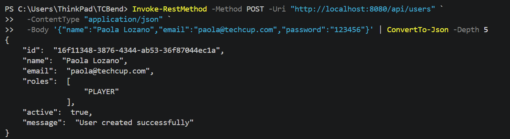
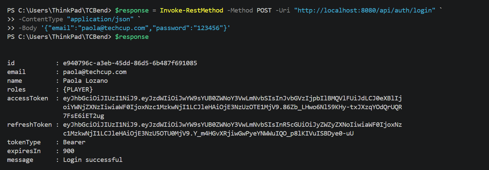
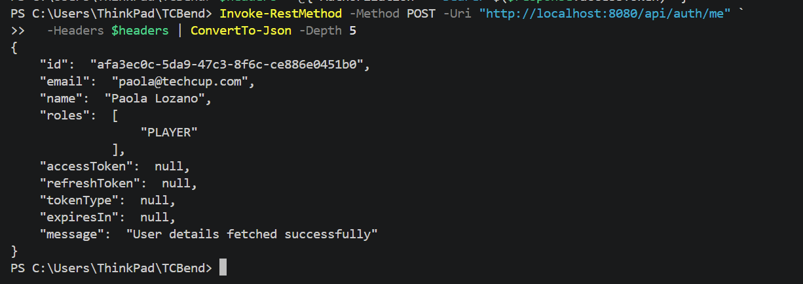
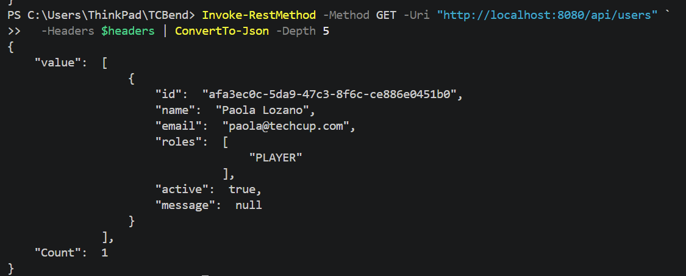

# TECHCUP FUTBOL - ECI


> [!IMPORTANT]
> This repository hosts the backend of the techcup project, here you will only find
> information related to such matter.
>
> Overall documentation can be found in the [homepage of
> the project](https://0strezz.github.io), there you will be able of inspect documentation
> more closely than you could in github's wiki feature (ignoring the fact that github disables
> repository wiki if the repo is privated)

> [!NOTE]
> Documentation has been moved to the project's homepage, however in the firsts weeks of the project
> when there was not homepage, the documentation was uploaded in this repository. Right now only
> `docs-related` contain that information
>
> For further information about the documentation and the project, please visit the [homepage](https://0strezz.github.io)

## Project Info

| Field       | Value                    |
|-------------|--------------------------|
| Group ID    | `edu.eci.dosw`           |
| Artifact ID | `tech_cup`               |
| Version     | `0.0.1-SNAPSHOT`         |
| Java        | 17                       |
| Spring Boot | 3.4.3                    |

---

## Runtime Dependencies

### Spring Boot

| Artifact                              | Version (managed) | Description                                      |
|---------------------------------------|-------------------|--------------------------------------------------|
| `spring-boot-starter`                 | 3.4.3             | Core Spring Boot starter (auto-configuration, logging, YAML) |
| `spring-boot-starter-web`             | 3.4.3             | REST API support via Spring MVC + embedded Tomcat |
| `spring-boot-starter-security`        | 3.4.3             | Authentication and authorization (Spring Security) |
| `spring-boot-starter-data-jpa`        | 3.4.3             | ORM and database access via Hibernate + Spring Data JPA |

### API Documentation

| Artifact                                    | Version | Description                          |
|---------------------------------------------|---------|--------------------------------------|
| `springdoc-openapi-starter-webmvc-ui`       | 2.5.0   | OpenAPI 3 / Swagger UI auto-generation for Spring MVC |

### Database

| Artifact      | Version (managed) | Scope   | Description                        |
|---------------|-------------------|---------|------------------------------------|
| `postgresql`  | 3.4.3             | runtime | PostgreSQL JDBC driver             |

### JWT (JSON Web Tokens)

| Artifact         | Version | Scope   | Description                              |
|------------------|---------|---------|------------------------------------------|
| `jjwt-api`       | 0.12.6  | compile | JJWT public API for creating/parsing JWTs |
| `jjwt-impl`      | 0.12.6  | runtime | JJWT implementation (runtime only)       |
| `jjwt-jackson`   | 0.12.6  | runtime | Jackson-based JSON serialization for JJWT |

### Utilities

| Artifact        | Version | Scope    | Description                                    |
|-----------------|---------|----------|------------------------------------------------|
| `lombok`        | managed | optional | Boilerplate reduction via annotations (@Getter, @Builder, etc.) |
| `dotenv-java`   | 3.0.0   | compile  | Loads environment variables from `.env` files  |

---

## Test Dependencies

| Artifact                       | Version (managed) | Scope | Description                                              |
|--------------------------------|-------------------|-------|----------------------------------------------------------|
| `spring-boot-starter-test`     | 3.4.3             | test  | Testing suite: JUnit 5, Mockito, AssertJ, Spring Test    |
| `h2`                           | managed           | test  | In-memory H2 database for integration/unit tests        |

---

## Build Plugins

| Plugin                          | Version    | Description                                               |
|---------------------------------|------------|-----------------------------------------------------------|
| `spring-boot-maven-plugin`      | 3.4.3      | Packages the app as an executable JAR; excludes Lombok    |
| `maven-surefire-plugin`         | 3.2.5      | Runs unit tests during the Maven build lifecycle          |
| `jacoco-maven-plugin`           | 0.8.12     | Code coverage instrumentation and reporting (min. 85% line coverage per package) |
| `sonar-maven-plugin`            | 4.0.0.4121 | SonarQube static analysis integration                     |

---

## Coverage & Quality Configuration

- **Minimum line coverage:** 85% per package (enforced by JaCoCo `check` goal)
- **JaCoCo XML report path:** `target/site/jacoco/jacoco.xml`
- **SonarQube exclusions:** `src/main/java/edu/eci/dosw/configurators/*`
- **SonarQube project key:** `tech_cup`

## Contributors

- [Ángela Gómez](https://github.com/MissGomezzz)
- [Paula Lozano](https://github.com/Valentina-33)
- [Tomas Olaya](https://github.com/iAxstral)
- [Samuel Castelblanco](https://github.com/Queruubin)
- [Diego Muñoz](https://github.com/0strezz)


## Running API in Visual Studio Code PowerShell
To verify the correct use of the created end points, we followed the next steps:

### Enviroment variables

```powershell
$env:DB_URL="jdbc:postgresql://localhost:5432/name_database_postgre"

$env:DB_USERNAME="postgres"

$env:DB_PASSWORD="your_password"

$env:JWT_SECRET="a-long-and-secure-password-for-jwt-123456789"
``` 

### Run the app
./mvnw spring-boot:run

After succesfully running we proved the end points: 

- **Registration of a user:**

```powershell
Invoke-RestMethod -Method POST -Uri "http://localhost:8080/api/users" `
  -ContentType "application/json" `
  -Body '{"name":"Name","email":"name@techcup.com","password":"password"}' | ConvertTo-Json -Depth 5
```



- **User's login**

```powershell
$response = Invoke-RestMethod -Method POST -Uri "http://localhost:8080/api/auth/login" `
  -ContentType "application/json" `
  -Body '{"email":"name@techcup.com","password":"123456"}'

$response | ConvertTo-Json -Depth 5
```


 

- **Get user's authetication**

```powershell
$response.accessToken | Set-Clipboard

$headers = @{ Authorization = "Bearer $($response.accessToken)" }

Invoke-RestMethod -Method POST -Uri "http://localhost:8080/api/auth/me" `
  -Headers $headers | ConvertTo-Json -Depth 5
```




---

We can make other some other requests:


