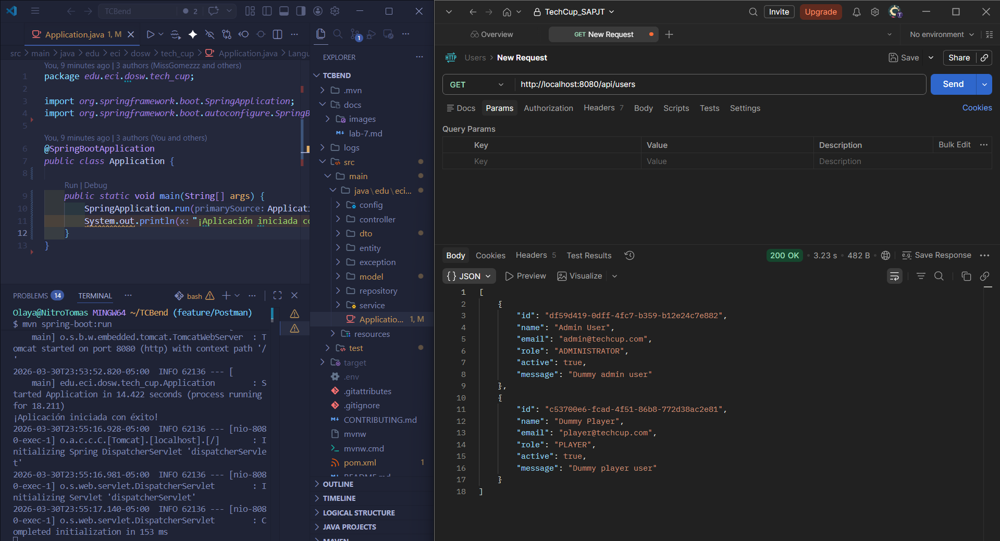

# Laboratory 8

## Part 1. Seguridad con Spring Boot Security

### 1. Postman

## Users endpoint test

The backend was successfully executed and the `/api/users` endpoint was verified using Postman.

The application responded with a `200 OK` status code and returned a list of users in JSON format.

For the project execution, environment variables were configured in a local `.env` file for the PostgreSQL connection.

---

### 2. Introduction

The `spring-boot-starter-security` dependency was added to the `pom.xml` file.

After adding the dependency, the `/api/users` endpoint now requires authentication. Without credentials, the request returns `401 Unauthorized`, confirming that Spring Security is active.

Custom credentials were then configured in `application.properties` using `spring.security.user.name` and `spring.security.user.password`. The project was rebuilt and the request was executed again successfully with `200 OK`.

#### 401 Unauthorized — endpoint protected by Spring Security (no credentials provided)

#### Request with default credentials (user + generated password) — 200 OK

#### Request with custom credentials — 200 OK

