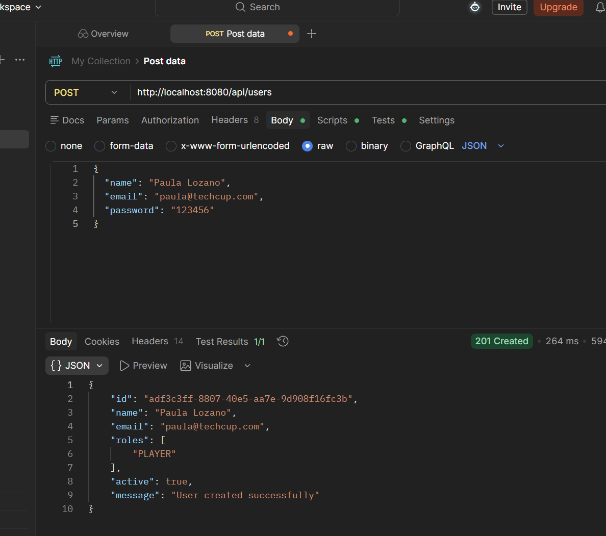
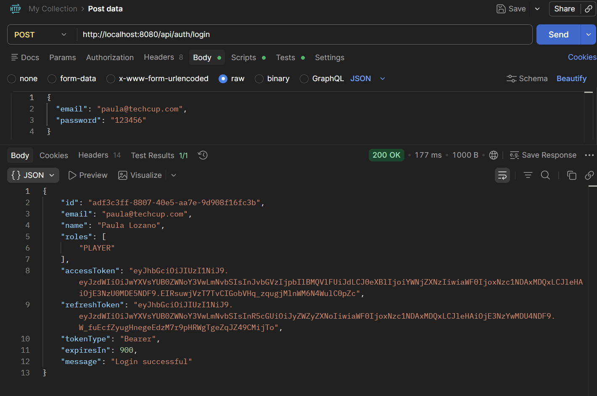
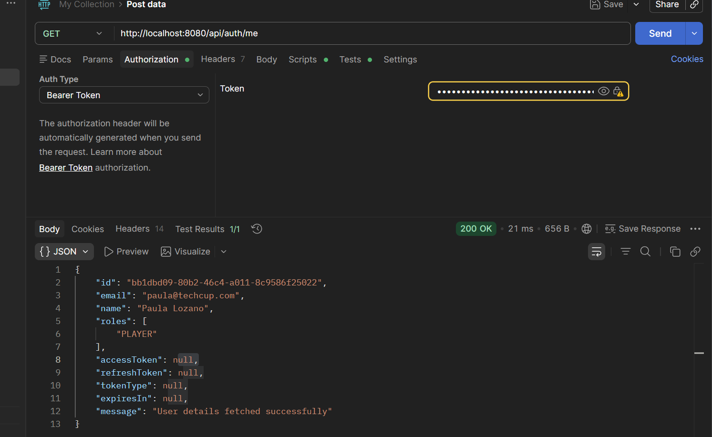
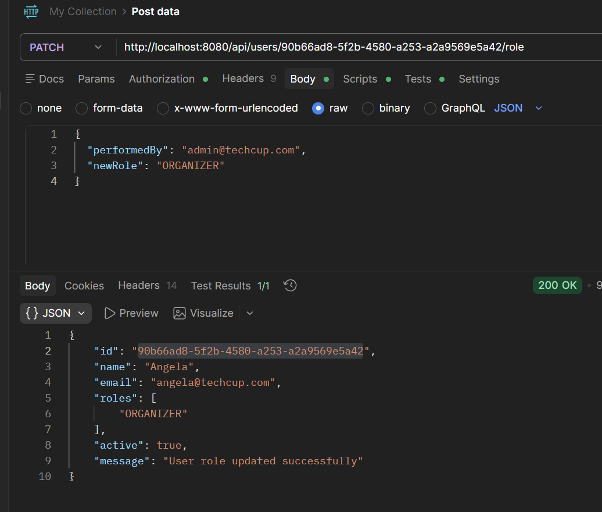

# Laboratory 9

## Running API in Visual Studio Code PowerShell
To verify the correct use of the created endpoints, we followed the next steps:

### Enviroment variables

```powershell
$env:DB_URL="jdbc:postgresql://localhost:5432/name_database_postgre"

$env:DB_USERNAME="postgres"

$env:DB_PASSWORD="your_password"

$env:JWT_SECRET="a-long-and-secure-password-for-jwt-123456789"
``` 

### Run the app

```powershell
./mvnw spring-boot:run
```


After succesfully running we proved the endpoints: 

<br>

- **Registration of a user:**

```powershell
Invoke-RestMethod -Method POST -Uri "http://localhost:8080/api/users" `
  -ContentType "application/json" `
  -Body '{"name":"Name","email":"name@techcup.com","password":"password"}' | ConvertTo-Json -Depth 5
```
<br>


<br>

- **User's login**

```powershell
$response = Invoke-RestMethod -Method POST -Uri "http://localhost:8080/api/auth/login" `
  -ContentType "application/json" `
  -Body '{"email":"name@techcup.com","password":"123456"}'

$response | ConvertTo-Json -Depth 5
```

<br>

 

<br>

- **Get user's authetication**

```powershell
$response.accessToken | Set-Clipboard

$headers = @{ Authorization = "Bearer $($response.accessToken)" }

Invoke-RestMethod -Method POST -Uri "http://localhost:8080/api/auth/me" `
  -Headers $headers | ConvertTo-Json -Depth 5
```
<br>


<br>

---

We can create some other requests:










<br>

---
## Role-based authorization

A role-based authorization mechanism was implemented using Spring Security. Restrictions were defined on the system's endpoints so that only users with the ADMINISTRATOR role can access critical functionalities such as user lookup and role assignment.
For testing purposes, a user with an administrator role was created, which allowed validating access to restricted endpoints. It was verified that:

Authenticated users without the administrator role cannot access protected endpoints (403 Forbidden).
Users with the ADMINISTRATOR role can correctly access those endpoints.

This ensures that the system not only authenticates users, but also controls the actions each one can perform based on their role.

<br>

## CSRF Protection
Protection against CSRF (Cross-Site Request Forgery) attacks was analyzed. These attacks consist of unauthorized requests being sent from an external site using a user's active session.
In our project, authentication was implemented using JWT and a stateless policy, meaning the application does not rely on HTTP sessions or traditional authentication cookies.
For this reason, CSRF protection was disabled in the security configuration:

```powershell
.csrf(csrf -> csrf.disable())
```

This decision is appropriate in REST APIs protected with JWT, since credentials are sent explicitly through the Authorization: Bearer <token> header rather than automatically by the browser.

<br>

## XSS Protection
Input data validation mechanisms were implemented to mitigate XSS (Cross-Site Scripting) attacks, which consist of injecting malicious code into input fields.
On the backend, validations were applied to the DTOs using annotations such as @NotBlank, @Email, and @Size, in order to ensure that the received data meets expected formats and does not contain invalid content.
Additionally, the @Valid annotation was used in the controllers to enable automatic validation of data received in HTTP requests.
These measures help reduce the risk of processing malicious inputs and strengthen the overall security of the system.

<br>

## Clickjacking
Protection against clickjacking was applied by configuring HTTP security headers in Spring Security. Specifically, X-Frame-Options was set to DENY, preventing the application from being loaded inside iframes or embedded frames on external sites. This reduces the risk of an attacker overlaying the application's interface and tricking the user into performing unintended actions.
