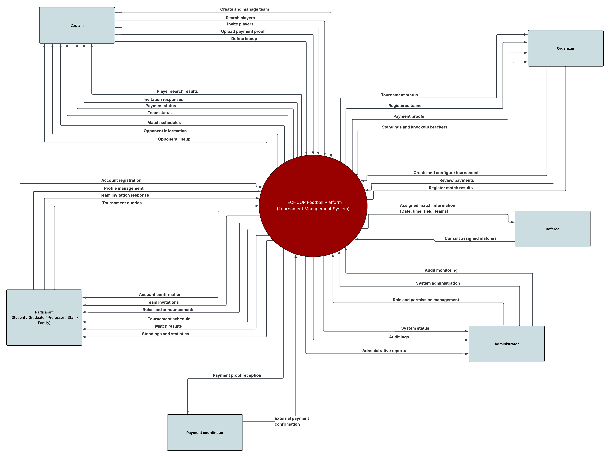

# Context diagram

The context diagram represents the TECHCUP Football Platform as the central system responsible for managing the semester football tournament. The diagram identifies the main external actors that interact with the system, including participants, captains, organizers, referees, administrators, and the payment coordinator.

Each actor interacts with the platform through specific actions and information exchanges. Participants can register, manage their player profiles, and consult tournament information. Captains can create teams, invite players, upload payment proofs, and define match lineups. Organizers are responsible for configuring tournaments, reviewing payments, and registering match results. Referees consult the matches assigned to them, while administrators supervise the system through role management and audit monitoring.

The payment coordinator represents the external payment process, since payments are performed outside the platform and later validated through uploaded payment proofs.

The context diagram therefore provides a high-level view of the interactions between external actors and the TECHCUP Football Platform, helping to define the scope of the system before proceeding to detailed functional requirements and system design.