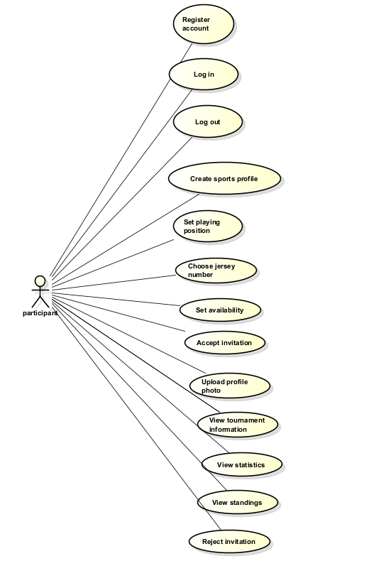
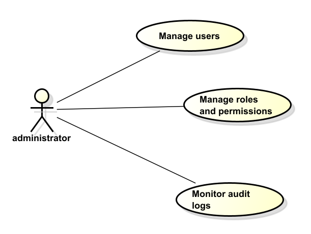
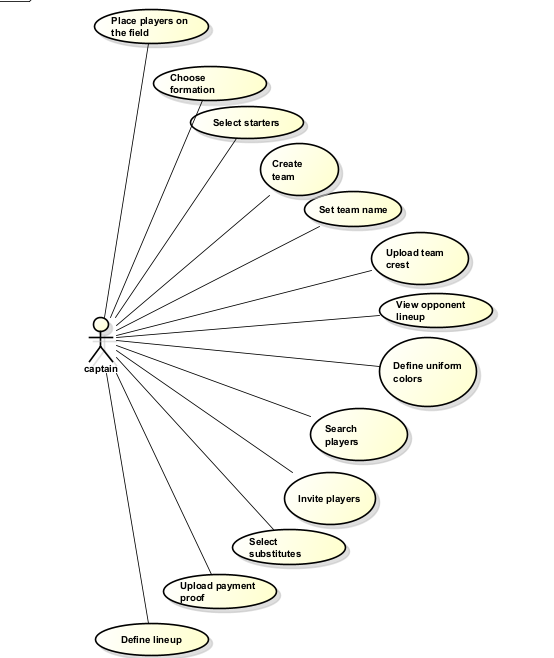

# User stories

| Field | Description |
|------|-------------|
| **ID** | US-01 |
| **Title** | Register account |
| **Description** | *AS a participant of the TECHUP Football Platform I WANT to create an account using my institutional email or my personal email if I am a family member SO THAT I can access the platform and participate in the tournament process* |
| **Priority** | *[High] Because account registration is the entry point to the platform and is required before accessing player, team, or tournament functionalities.* |

| Field | Description |
|------|-------------|
| **ID** | US-02 |
| **Title** | Log in to the platform |
| **Description** | *AS a registered participant I WANT to log in securely to the platform SO THAT I can access my profile and use the system functionalities according to my role* |
| **Priority** | *[High] Because authenticated access is necessary to protect user information and ensure role-based interaction with the system.* |

| Field | Description |
|------|-------------|
| **ID** | US-03 |
| **Title** | Create sports profile |
| **Description** | *AS a participant I WANT to create and complete my sports profile with my playing position, jersey number, and photo SO THAT captains can identify and evaluate whether I fit their team needs* |
| **Priority** | *[High] Because the sports profile is essential for team formation and player identification within the tournament.* |

| Field | Description |
|------|-------------|
| **ID** | US-04 |
| **Title** | Set availability as a player |
| **Description** | *AS a participant I WANT to mark myself as available to join a team SO THAT captains can find me and invite me to participate in the tournament.* |
| **Priority** | *[High] Because it supports the team-building process and helps captains complete their rosters efficiently* |

| Field | Description |
|------|-------------|
| **ID** | US-05 |
| **Title** | Respond to team invitations |
| **Description** | *AS a participant I WANT to accept or reject invitations sent by captains SO THAT I can decide which team I want to join and keep control over my participation in the tournament.* |
| **Priority** | *[High] Because participants must be able to confirm or decline team invitations in a traceable way.* |

| Field | Description |
|------|-------------|
| **ID** | US-06 |
| **Title** | View tournament information |
| **Description** | *AS a participant I WANT to consult tournament information such as rules, important dates, schedules, and results.* |
| **Priority** | *[High] Because centralized tournament information improves transparency and reduces confusion among participants* |

| Field | Description |
|------|-------------|
| **ID** | US-07 |
| **Title** | Create a team |
| **Description** | *AS a captain I WANT to create a team with a name, crest, and uniform colors SO THAT I can organize a group of players and prepare it for tournament registration* |
| **Priority** | *[High] Because team creation is one of the main functions of the platform and is necessary for tournament participation* |

| Field | Description |
|------|-------------|
| **ID** | US-08 |
| **Title** | Search players |
| **Description** | *AS a captain I WANT to search for players by position, semester, age, gender, name, or identification SO THAT I can find suitable players to complete my team* |
| **Priority** | *[High] Because captains need effective search criteria to build balanced teams* |

| Field | Description |
|------|-------------|
| **ID** | US-09 |
| **Title** | Invite players to my team |
| **Description** | *AS a captain I WANT to send invitations to available players SO THAT I can complete the minimum number of players required for my team* |
| **Priority** | *[High] Because team completion depends on the captain's ability to contact and recruit players through the platform* |

| Field | Description |
|------|-------------|
| **ID** | US-10 |
| **Title** | Upload payment proof |
| **Description** | *AS a captain I WANT to upload the payment proof for my team's registration SO THAT the organizer can review it and approve my team's participation in the tournament* |
| **Priority** | *[High] Because payment validation is required before a team can be officially approved to participate in the tournament* |

| Field | Description |
|------|-------------|
| **ID** | US-11 |
| **Title** | Define team lineup |
| **Description** | *AS a captain I WANT to select starters, substitutes, and the formation for each match SO THAT my team can be properly organized before the game begins* |
| **Priority** | *[High] Because lineups are necessary to prepare each match and provide visibility for both teams before playing* |

| Field | Description |
|------|-------------|
| **ID** | US-12 |
| **Title** | Create tournament |
| **Description** | *AS an organizer I WANT to create a tournament with basic information such as start date, end date, number of teams, cost, and status SO THAT I can initialize and manage the competition through the platform* |
| **Priority** | *[High] Because tournament creation is the basis for all other administrative and operational processes in the platform* |

| Field | Description |
|------|-------------|
| **ID** | US-13 |
| **Title** | Configure tournament rules and schedule |
| **Description** | *AS an organizer I WANT to define the rules, important dates, registration deadline, match schedules, fields, and sanctions* |
| **Priority** | *[High] Because proper tournament configuration ensures transparency, order, and consistency during the competition* |

| Field | Description |
|------|-------------|
| **ID** | US-14 |
| **Title** | Review payment proofs |
| **Description** | *AS an organizer I WANT to review the payment proofs uploaded by captains and approve or reject them SO THAT only eligible teams can participate in the tournament* |
| **Priority** | *[High] Because payment approval is a mandatory condition for official tournament registration* |

| Field | Description |
|------|-------------|
| **ID** | US-15 |
| **Title** | Register match results |
| **Description** | *AS an organizer I WANT to register match results, scorers, yellow cards, and red cards SO THAT the system can update standings and maintain tournament statistics automatically* |
| **Priority** | *[High] Because match data is necessary for standings, statistics, and the overall progress of the tournament* |

| Field | Description |
|------|-------------|
| **ID** | US-16 |
| **Title** | View assigned matches |
| **Description** | *AS a referee I WANT to view the matches assigned to me, including date, time, field, and teams SO THAT I can be properly informed before officiating each match* |
| **Priority** | *[High] Because referees need access to their assigned match information to support the operational execution of the tournament* |

| Field | Description |
|------|-------------|
| **ID** | US-17 |
| **Title** | Manage roles and permissions |
| **Description** | *AS an administrator I WANT to manage user roles and permissions SO THAT the platform remains secure and each user can only access the functions allowed for their role* |
| **Priority** | *[High] Because role-based control is essential for system security* |

| Field | Description |
|------|-------------|
| **ID** | US-18 |
| **Title** | Monitor audit logs |
| **Description** | *AS an administrator I WANT to review audit logs of relevant system actions SO THAT I can monitor activity, ensure traceability, and detect possible misuse of the platform* |
| **Priority** | *[Medium] Because audit monitoring supports accountability, security, and administrative control of the platform* |

# Use cases diagrams

## Participant

---

## Administrator

---

## Captain

---

## Organizer

---

## Referee

---

## Help

If something is missing or the `../requirements.pdf` document changes, please re-open  
 and fix/add whatever is now requested.  
(**also modify the UMLs.asta file in such case**).
