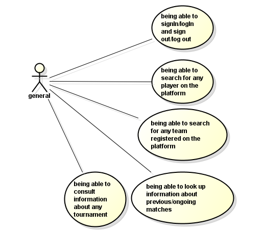
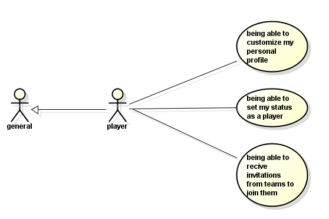
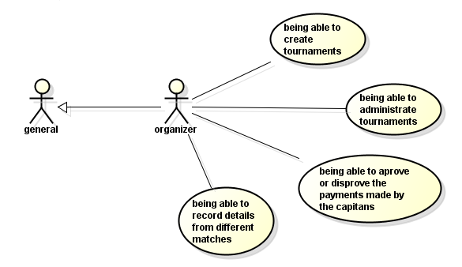
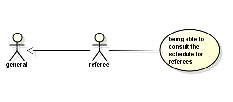

# Use cases diagrams

## General

---

## Player

---

## Capitan

---

## Organizer

---

## Referee

---

## Help

If something is missing or the `../requirements.pdf` document changes, please
re open  and fix/add
whatever is now requested. (**also modify the UMLs.asta file in such case**).
